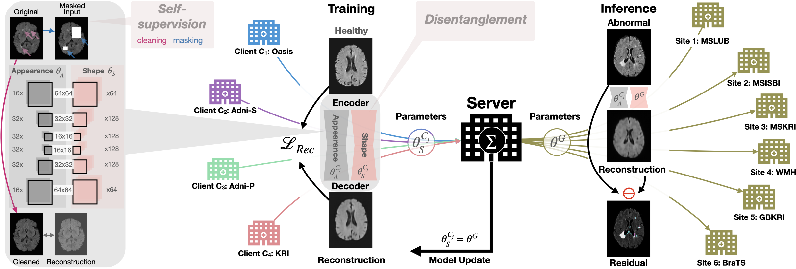

[](https://creativecommons.org/licenses/by-nc-nd/4.0/)

# FedDis: Disentangled Federated Learning for Unsupervised Brain Pathology Segmentation

This repository contains the code for our paper on [FedDis: Federated Disentangled Representation Learning for Unsupervised Brain Anomaly Detection](https://assets.researchsquare.com/files/rs-722389/v1_covered.pdf?c=1631875543). 
If you use any of our code, please cite:
```
@article{bercea2021feddis,
  title={FedDis: Disentangled Federated Learning for Unsupervised Brain Pathology Segmentation},
  author={Bercea, Cosmin I and Wiestler, Benedikt and Rueckert, Daniel and Albarqouni, Shadi},
  journal={arXiv preprint arXiv:2103.03705},
  year={2021}
}

```

* [FedDis: Disentangled Federated Learning for Unsupervised Brain Pathology Segmentation](#fedis:-disentangled-federated-learning-for-unsupervised-brain-pathology-segmentation)
  * [Requirements](#requirements)
  * [Folder Structure](#folder-structure)
  * [Usage](#usage)
      * [Data](#data)
      * [Config file format](#config-file-format)
      * [Usage](#cli-usage)
  * [Disclaimer](#disclaimer)
  * [License](#license)
    

<!-- /code_chunk_output -->

## Requirements
* Python >= 3.6
* This project is based on the federated framework [ILIA](https://github.com/albarqounilab/ILIA) and 
  the [MONAI](https://monai.io) framework

All additional packages used in this repository are listed in [requirements.txt](https://github.com/albarqounilab/FedDis/blob/main/requirements.txt).
To install those, run `pip3 install -r requirements.txt`

## Folder Structure
  ```
  FedDis/
  │
  ├── feddis_main.py - execute to run in commandline
  ├── FedAnalytics.py - Stats and evaluations at the end of epochs/training (not implemented)
  ├── FedDownstreamTask.py - Downstream evaluations for anomaly segmentation and reconstruction fidelity
  ├── FedPlanner.py - Plans and starts the experimens
  ├── FedVizu.py - Visuailzations at the end of epochs/training (not implemented)
  
  MONAI/monai/ 
  ├── ILIA/- Federated framework based on PyTorch
  │   ├── core/ - Configuration of the project and experiment
  │   ├──   ├── FedAggregator/ - Moderates federated traing / Aggregates local updates
  │   ├──   ├── FedAnalytics/ - Stats and evaluations at the end of epochs/training
  │   ├──   ├── FedCollaborator/ - Client-side training and testing
  │   ├──   ├── FedDownstreamTask/ - Downstream evaluations, e.g., Anomaly Detection
  │   ├──   ├── FedPlanner/ - Plans and starts the experimens
  │   ├──   ├── FedVizu/ - Visuailzations at the end of epochs/training
  │   ├── data/ - dataloaders
  │   ├── models/ - Configuration of different federated methods, e.g., FedAvg, FedDis, SiloBN, etc..
  │
  ├── losses/ - Definition of losses 
  ├── metrics/ - Definition of metrics
  ├── networks/ - Definition of networks (e.g., autoencoder.py)
  ├── optimizers/ - Definition of optimizers
  ├── transforms/ - Definition of transforms
  ├── utils/ - Definition of utils 

  ```

## Usage

### Data
The publicly available healthy training data used can be downloaded here:

[OASIS-SI](https://www.oasis-brains.org)

[ADNI-SI and ADNI-Ph](http://adni.loni.usc.edu/data-samples/access-data/)

The publicly available datasets containing anomaly can be downloaded here:

[MSLUB](http://lit.fe.uni-lj.si/tools.php?lang=eng)

[MSISBI](https://smart-stats-tools.org/lesion-challenge-2015)

[WMH](https://wmh.isi.uu.nl)

[BRATS](https://www.med.upenn.edu/sbia/brats2018/data.html)


### Config file format
Define the config file including the desired network, datasets and training hyper-parameters, see the example provided
config/feddis_config.yaml.

If you want to use your own dataset, check how the dataloaders in `MONAI/monai/ILIA/data/BrainMR/anomaly_detection.py` 
are defined and implement your own to work with our code.
  ```
  ## YAML CONFIG FILE

name: FedDis
experiment:
  name: ILIA-test
  task: test
  models:
    client_OASIS: '/path_to_checkpoint/checkpoints/client_OASIS_best_global_model.pt'
    client_ADNI-S: '/path_to_checkpoint/checkpoints/client_ADNI-S_best_global_model.pt'
    client_ADNI-P: '/path_to_checkpoint/checkpoints/client_ADNI-P_best_global_model.pt'
    client_KRI: '/path_to_checkpoint/checkpoints/client_KRI_best_global_model.pt'
logging: 1
device: gpu
model:
  module_name: monai.networks.nets.disentangled_autoencoder
  class_name: DisAutoEncoder
  params:
    intermediate_res: !!python/tuple [16,16]
    filters_start_shape: 64
    filters_max_shape: 128
    filters_start_app: 16
    filters_max_app: 32
    use_batchnorm: True
collaborator:
  module_name: monai.ILIA.models.FedDis.FedCollaborator
  class_name: FedDisCollaborator
  names:
    - OASIS
    - ADNI-S
    - ADNI-P
    - KRI
  params:
    nr_epochs: 5
    max_iterations: 1000 # FedVC
    checkpoint_path: '/path_to_checkpoint/Ilia-test/'
    data_loader:
      module_name: monai.ILIA.data.BrainMR.anomaly_detection
      class_name: NatureHealthyDataLoader
      params:
        image_size: !!python/tuple [256, 256]
        target_size: !!python/tuple  [128, 128]
        slice_range: !!python/tuple [70, 100]
        batch_size: 8
    self_supervision:
      use: True
      params:
        start_x_range: !!python/tuple [30, 90]
        start_y_range: !!python/tuple [20, 90]
        width_range: !!python/tuple [3, 20]
        max_rectangles: 3
        cval: -1 # -1 = random hyper-intensity
    optimizer_params:
      lambda_R: 0.2
      lambda_S: 1
      lambda_L: 1
      round_scl_injection: 25
      decay_rate: 0.97
      learning_rate: 0.0001
      gamma_shift: !!python/tuple [0.5, 2]
      use_shape_pair: False
aggregator:
  module_name: monai.ILIA.models.FedDis.FedAggregator
  class_name: FedDisAggregator
  params:
    nr_rounds: 50
    client_num_in_total: 4
    client_num_per_round: 4
    test_frequency: 3
    checkpoint_path: '/path_to_checkpoint/Ilia-test/'
test_data:
  data_loader_healthy:
    dataset_names:
      - OASIS
      - ADNI-S
      - ADNI-P
      - KRI
    module_name: monai.ILIA.data.BrainMR.anomaly_detection
    class_name: NatureHealthyDataLoader
    params:
      image_size: !!python/tuple [256, 256]
      target_size: !!python/tuple  [128, 128]
      slice_range: !!python/tuple [70, 100]
      batch_size: 8
  data_loader_anomaly:
    dataset_names:
      - MSLUB
      - MSISBI
      - MSKRI
      - GBKRI
      - BRATS
    module_name: monai.ILIA.data.BrainMR.anomaly_detection
    class_name: NatureAnomalyDataLoader
    params:
      image_size: !!python/tuple [256, 256]
      target_size: !!python/tuple  [128, 128]
      slice_range: !!python/tuple [15, 125]
      batch_size: 1
downstream_tasks:
  module_name: monai.ILIA.projects.nature_mi_21.FedDownstreamTask
  class_name: FedDisDownstreamTask
  params:
analytics:
  module_name: monai.ILIA.projects.nature_mi_21.FedAnalytics
  class_name: FedDisAnalytics
  params:
vizu:
  module_name:  monai.ILIA.projects.nature_mi_21.FedVizu
  class_name: FedDisVizu
  params:
  
  ```

### Usage
For the results of our paper we used `feddis_main.py`. 
If you wish just to evaluate an already trained model, set the experiment/task in the config file to test and link to 
the saved model parameters. 

## Disclaimer
The code has been cleaned up and polished for clarity and reproducibility. While the code has been thoroughly reviewed, it may contain bugs or errors. Please contact shadi.albarqouni@ukbonn.de if you encounter any problem in this repository.

## License
This project is licensed under the Attribution-NonCommercial-NoDerivatives 4.0 International (CC BY-NC-ND 4.0). See [LICENSE](https://github.com/albarqounilab/FedDis-NMI/blob/main/LICENSE.md) for more details
